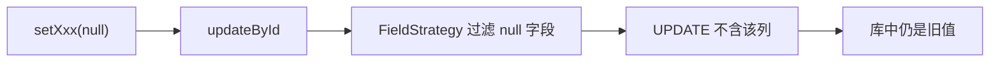

> 「后端踩坑手记」| 第 1 期

---

## 你是否也遇到过这些场景

如果你用 MyBatis-Plus 做过业务单的「撤回 / 作废 / 流程结束清理」，下面几幕大概不陌生。

**场景一：流程结束了，流程实例 ID 却清不掉。**

你在某审批系统里把业务单 `BizRecord` 的流程实例字段设为 `null`，调用 `updateById`，日志也没报错。再查库——`process_instance_id` 还是老值。前端据此以为「还在审批中」，用户一脸懵。

**场景二：草稿里残留上一次的流程 ID。**

业务单从审批驳回回到草稿，你的自愈逻辑会「清空流程关联」。代码写得明明白白 `setProcessInstanceId(null)`，可数据库就是不更新。测试同事复现：新建草稿点保存，列表仍显示「已提交」态。

**场景三：你以为 Java 的 null 会原样写进 SQL。**

ORM 课上教过「null 表示未知」，你自然觉得「字段 null → SQL SET NULL」。MyBatis-Plus 的默认字段策略（Field Strategy）却不是这么想的——**很多版本下，null 字段根本不会出现在 UPDATE 语句里**。

如果你中过任意一条，这篇就是写给你的。

---

## 问题的本质是什么

MyBatis-Plus 在 `updateById(entity)` 时，会扫描实体里**非 null** 的字段生成 `SET` 子句。这是刻意的「防误删」设计：避免你把没赋值的字段误更新成 null。

所以当你：

```java
record.setProcessInstanceId(null);
bizRecordMapper.updateById(record);
```

生成的 SQL 往往**没有** `process_instance_id = NULL` 这一项——旧值被完整保留。这就是典型的「僵尸数据」：代码逻辑上已清空，持久层却拒绝执行。



| 方式 | null 字段是否写入库 |
|------|---------------------|
| `updateById(entity)` | 通常 **否**（默认 NOT_NULL / 忽略 null） |
| `UpdateWrapper.set(col, null)` | **是**，显式 SET NULL |

> 💡 提示：全局 `update-strategy` 改成 `ignored` 虽能让 `updateById` 写入 null，但会放大「误更新未赋值字段」的风险；**清空单列更推荐 Wrapper 显式 set**。

---

## 环境

Spring Boot 3.2.x · MyBatis-Plus 3.5+

---

## 怎么解决

以业务单 `BizRecordDO` 为例，需要把 `process_instance_id` 清成数据库 NULL 时：

```java
// ❌ 错误：null 字段可能被 MP 忽略，库里仍是旧流程 ID
BizRecordDO record = new BizRecordDO();
record.setId(bizId);
record.setProcessInstanceId(null);
bizRecordMapper.updateById(record);
```

```java
// ✅ 正确：显式 SET NULL
bizRecordMapper.update(
    null,
    new LambdaUpdateWrapper<BizRecordDO>()
        .eq(BizRecordDO::getId, bizId)
        .set(BizRecordDO::getProcessInstanceId, null));
```

若你曾在日志里看到过「执行成功但列未变」，可以对照脱敏后的应用日志：

```bash
# 业务单 ID 已替换
DEBUG c.b.BizRecordServiceImpl - clear processInstanceId, bizId=10086
DEBUG c.b.m.BizRecordMapper.updateById - ==> Parameters: 10086(Long)
# 注意：SQL 中往往没有 process_instance_id 列
```

**验证**：更新后 `SELECT process_instance_id FROM biz_record WHERE id = ?` 应为 `NULL`；接口返回该字段也为 null，前端不再显示审批中。

---

## 怎么避免下次再踩

1. **凡是要「清空外键 / 流程 ID / 可空状态」的路径，默认用 `LambdaUpdateWrapper.set(..., null)`**，不要赌 `updateById`。
2. Code Review 看到 `setXxx(null)` + `updateById` 组合，直接标红。
3. 集成测试加断言：清空后查库列必须为 NULL，不只断言「方法没抛异常」。
4. 团队 Wiki / runbook 里写一句：**「MP 的 null ≠ SQL NULL」**，新人 onboarding 省半天。
5. 若必须用 `updateById`，先查清全局与字段级 `FieldStrategy`，别在生产上临时改全局策略当万能药。

---

## 小结

`updateById` 忽略 null 不是 bug，是默认策略；要把列真正清掉，就用 Wrapper 显式 `set` 成 null。流程类业务单一旦清不干净，前后端状态会长期不一致。整理自团队实践。

你还遇到过类似的坑吗？欢迎到 [GitHub Issues](https://github.com/myBigger/biggerBlog/issues) 聊聊你踩过的坑。

---

## 延伸阅读

- [MyBatis-Plus 更新策略（中文）](https://baomidou.com/pages/223848/)
- [MyBatis-Plus 条件构造器 · Update](https://baomidou.com/pages/10ea0a/)

---

**系列导航**

- 目录：[第 1 期（本篇）](/posts/backend-pitfalls-01-mybatis-null) · [第 2 期](/posts/backend-pitfalls-02-bpm-assignee)（草稿） · [第 3 期](/posts/backend-pitfalls-03-snapshot-bpm)（草稿）
- 另见：[必哥手记 · Qt 网络编程的真相](/posts/qt-network-truth)
