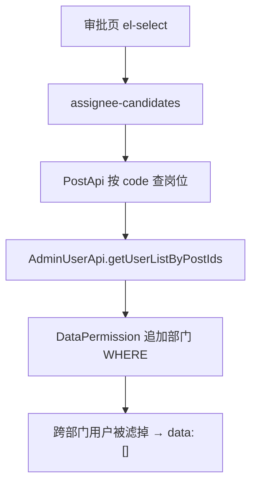

> 「后端踩坑手记」| 第 2 期

---

## 你是否也遇到过这些场景

Flowable（BPM 引擎）审批页上，「下一节点办理人」下拉经常是 blank 的重灾区——尤其当你按**岗位 code** 从全组织里挑人时。

**场景一：接口 200，data 却是空数组。**

前端 `el-select` 绑的是 `assignee-candidates` 接口，Network 面板里状态码绿油油，响应体却是 `{"code":0,"data":[]}`. 岗位配置表你刚查过，人明明在，页面上就是选不了。

**场景二：把角色改成「全部数据权限」就好了。**

同事临时给测试账号开了「全部数据」，下拉立刻有名字。你心里一沉：这不是岗位配错了，是**查询用户时被数据权限（Data Permission）滤光了**。

**场景三：抄送人列表有数据，办理人却没有。**

同一审批页，抄送 `simple-list` 能拉出本部门同事，办理人却要跨部门选上级。抄送范围碰巧在权限内，办理人查询却踩了**部门范围**——两个接口，两种命运。

---

## 问题的本质是什么

常见开源后台（如带 `@DataPermission` 的那类）会在 MyBatis 查询 `AdminUser` 时，按**当前登录人可见的部门**自动追加 WHERE 条件。这对「台账列表只能看本监区」是刚需，但对 **BPM 按岗位拉全组织候选人** 却是误伤：

1. 前端根据 `taskDefinitionKey` 映射到 `scene`（如 `deptLeader`、`crossDeptLeader`）。
2. 后端用 `scene` 换一组岗位 code，再 `getUserListByPostIds`。
3. 数据权限拦截器把**不在你部门树里的用户**全部过滤掉 → 接口返回 `[]`。



岗位表、用户岗位关联表单独 SQL 能查到人，**并不代表**走 API 还能看见——中间多了一层权限插件。

---

## 环境

Spring Boot 3.2.x · Flowable 7.0+ · Vue 3 + Element Plus

---

## 怎么解决

**业务口径**（建议写进团队规范）：

| 场景 | 是否套部门数据权限 |
|------|-------------------|
| 业务单列表 / 详情 / 编辑 | **是** |
| BPM `assignee-candidates` 按岗位选人 | **否**（仅该查询忽略） |
| 抄送 `simple-list` | 通常 **是**（除非产品明确要跨部门抄送） |

代码上，在**用户查询**这一小段用框架提供的 ignore 工具（名称因项目而异，常见 `DataPermissionUtils.executeIgnore`），范围压到最小：

```java
// ❌ 错误：整段 Service 包在 ignore 里，可能连带放宽列表查询
public List<UserVO> listAssigneeCandidates(String scene) {
    return DataPermissionUtils.executeIgnore(() -> {
        List<Long> postIds = resolvePostIds(scene);
        return queryBizRecords(); // 误伤：列表也被 ignore 了
    });
}
```

```java
// ✅ 正确：只 ignore「按岗位查用户」这一刀
public List<UserVO> listAssigneeCandidates(String scene) {
    List<Long> postIds = postApi.getPostIdsByCodes(resolvePostCodes(scene));
    List<AdminUserRespDTO> users = DataPermissionUtils.executeIgnore(
        () -> adminUserApi.getUserListByPostIds(postIds));
    return convert(users);
}
```

提交审批时仍要做 **办理人合法性校验**（userId 必须在刚算出的候选集合里），防止 ignore 后被伪造 id 钻空子。

脱敏日志对照（修复后应能看到 `resultCount > 0`）：

```bash
INFO  c.b.BpmAssigneeController - assignee-candidates scene=crossDeptLeader tenantId=1
INFO  c.b.BpmAssigneeController - posts count=3 postCodes=[chief,deputy,...]
INFO  c.b.BpmAssigneeController - users rawCount=18 resultCount=12
```

> ⚠️ 注意：不要用「把角色改成全部数据权限」当长期方案——那是在全局放大漏洞，不是修 API。

---

## 怎么避免下次再踩

1. 新台账接 BPM 时，**assignee-candidates 与列表查询分方法**，ignore 只包用户查询。
2. 前端维护 `taskDefinitionKey → scene` 映射表，与流程定义同步评审。
3. 日志区分 `posts empty` 与 `users empty`，排障少猜一半。
4. 用**非「全部数据」的普通账号**做 UAT，专门测跨部门选人。
5. 中长期可在 `system-api` 提供「按岗位查人、忽略数据权限」的**专用接口**，避免各业务模块复制粘贴 `executeIgnore`。

---

## 小结

办理人为空，多半是数据权限在帮你「过度尽责」。列表要权限、选人要全局，把 ignore 范围控制在查用户那一行即可。整理自团队实践。

你还遇到过类似的坑吗？欢迎到 [GitHub Issues](https://github.com/myBigger/biggerBlog/issues) 聊聊你踩过的坑。

---

## 延伸阅读

- [Flowable 官方文档 · User tasks](https://www.flowable.com/open-source/docs/bpmn/ch07b-BPMN-Constructs#user-task)
- 检索关键词：若依 数据权限 `DataPermission`（按你使用的开源后台对照）

---

**系列导航**

- 目录：[第 1 期](/posts/backend-pitfalls-01-mybatis-null) · [第 2 期（本篇）](/posts/backend-pitfalls-02-bpm-assignee) · [第 3 期](/posts/backend-pitfalls-03-snapshot-bpm)（草稿）
- 上一篇：[第 1 期 · MyBatis-Plus 为什么写不进 NULL](/posts/backend-pitfalls-01-mybatis-null)
- 下一篇：[第 3 期 · 审批单为什么要「主表+明细+JSON 快照」？](/posts/backend-pitfalls-03-snapshot-bpm)（草稿）
- 另见：[必哥手记 · Qt 网络编程的真相](/posts/qt-network-truth)
