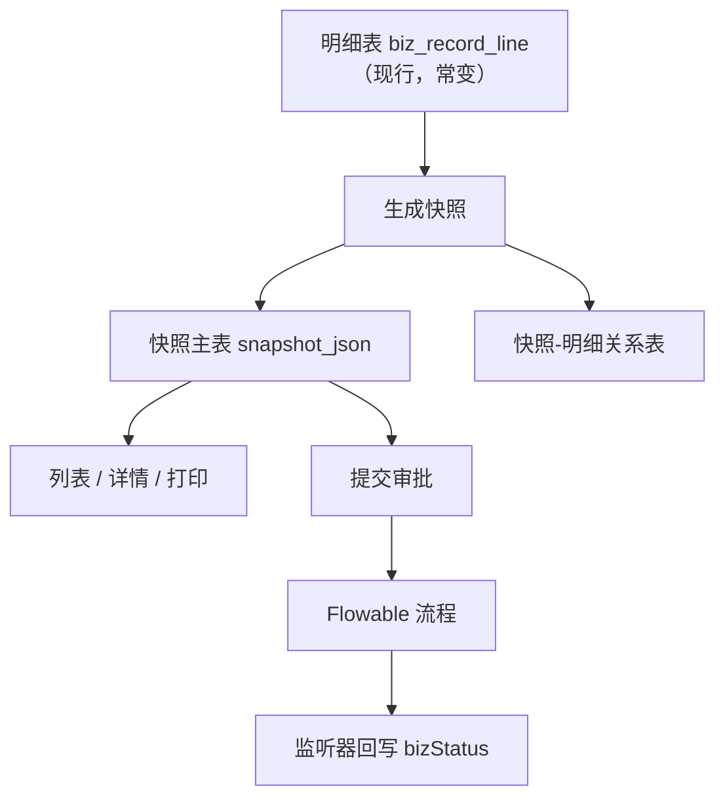
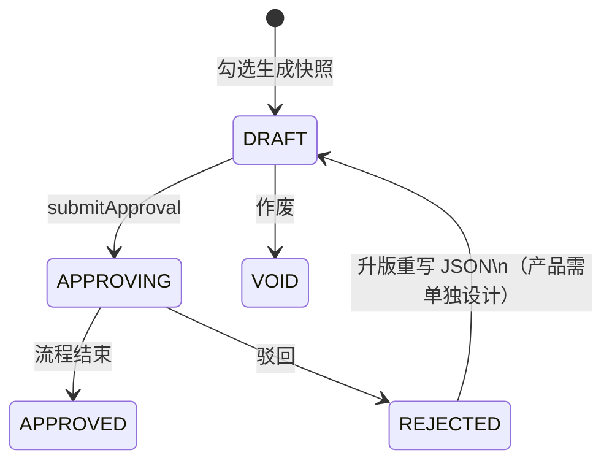

> 「后端踩坑手记」| 第 3 期

---

## 你是否也遇到过这些场景

某审批系统里，业务单 `BizRecord` 往往有「主表 + 多行明细」。明细在库里天天变，审批却要回答：**「送审那一刻长什么样？」**

**场景一：审批通过了，明细又被改了一版。**

审计问：「当时批的是哪几条、什么数量？」你打开明细表——已经是下周的数。流程历史只有「同意」，对不上业务真相。

**场景二：驳回后改明细再提交，旧流程 ID 还在。**

产品说「驳回后改完再报」。开发在旧主表上改字段、重启流程，前端列表有时读主表、有时读流程变量，**状态与展示两套口径**，用户看见「已通过」字样，表格却是新数据。

**场景三：列表用明细表拼，详情用 JSON，两套数打架。**

列表页查 `biz_record_line` 实时汇总，详情页却展示审批时冻住的表头表体。同一单号，两个页面两个故事——这不是前端 bug，是**数据模型没分清「现行」与「时点」**。

---

## 问题的本质是什么

审批关心的是**时点快照**，业务日常关心的是**现行明细**。混在一张表里，必然有一方吃亏。

推荐的一套落地模型（团队在多类业务单上验证过）：

| 层次 | 存什么 | 谁在读 |
|------|--------|--------|
| 明细表 | 随时可改的「当前真相」 | 录入、编辑、汇总 |
| 快照主表 | `snapshot_json` + `bizStatus` + `processInstanceId` | 审批列表、历史留痕 |
| 关系表 | 当时勾选了哪些明细行 id | 追溯来源，**不当表格主数据源** |

三条铁律：

1. **审批页、历史页：只认 `snapshot_json`**（解析 `header / columns / rows` 画表）。
2. **`sourceIdsJson` / 关系表**：只回答「当时选了哪几行」，不要拿来拼主表格。
3. **提交审批**改的是快照上的状态（草稿 → 审批中 → 通过/驳回），**不会**自动改 JSON 里的业务字段——要改内容，应走「升版 / 重新生成快照」产品规则。





---

## 环境

Spring Boot 3.2.x · Flowable 7.0+ · MyBatis-Plus 3.5+

---

## 怎么解决

### 1. 生成快照：把「此刻」冻进 JSON

用户勾选若干明细行 → 后端读取当前行数据 → 序列化进 `snapshot_json`，并写关系表记录 `lineId` 列表。快照行 `bizStatus = DRAFT`。

```java
// ✅ 生成快照：从现行明细组装 JSON，插入快照主表 + 关系表
public Long generateSnapshot(GenerateSnapshotReq req) {
    List<BizRecordLineDO> lines = lineMapper.selectBatchIds(req.getLineIds());
    SnapshotPayload payload = snapshotAssembler.fromLines(lines); // header/columns/rows
    BizRecordSnapshotDO snap = new BizRecordSnapshotDO();
    snap.setSnapshotJson(JsonUtils.toJsonString(payload));
    snap.setSourceIdsJson(JsonUtils.toJsonString(req.getLineIds()));
    snap.setBizStatus(BizStatusEnum.DRAFT);
    snap.setSnapshotVersion(1);
    snapshotMapper.insert(snap);
    relationMapper.batchInsert(snap.getId(), req.getLineIds());
    return snap.getId();
}
```

### 2. 提交审批：只动快照状态 + 启流程

仅 `DRAFT` 允许 `submitApproval`：写 `processInstanceId`、状态改 `APPROVING`，变量里带下一节点办理人。明细表**不必**在提交瞬间再抄一遍——展示以 JSON 为准。

```java
// ❌ 错误：审批页仍查明细表实时数据，驳回后明细一改，历史对不上
public SnapshotDetailVO getDetail(Long id) {
    return lineMapper.selectBySnapshotId(id); // 读的是「现在」
}
```

```java
// ✅ 正确：详情只解析 snapshot_json
public SnapshotDetailVO getDetail(Long id) {
    BizRecordSnapshotDO snap = snapshotMapper.selectById(id);
    return SnapshotDetailVO.fromJson(snap.getSnapshotJson());
}
```

### 3. 流程结束：监听器改 `bizStatus`

`BpmSnapshotStatusListener` 在流程通过/驳回时把快照主表状态改为 `APPROVED` / `REJECTED`。需要清空流程实例 id 时，记得用 [第 1 期](/posts/backend-pitfalls-01-mybatis-null) 的 **Wrapper 显式 SET NULL**，别用裸 `updateById`。

### 4. 驳回后再报（产品要提前定规）

当前很多实现是：**驳回后不能再次 `submitApproval` 同一条快照**。若要「同 id 升版」：

- `snapshotVersion++`，重写 `snapshot_json` 与关系表；
- 启新流程实例，旧 `processInstanceId` 归档或清空。

这与「每次驳回 insert 新快照 id」是两种方案，团队选一种写进 PRD，避免开发各写各的。

关系表快查（表名脱敏）：

```sql
SELECT id, biz_status, snapshot_version, process_instance_id
FROM biz_record_snapshot WHERE id = 10001;
-- snapshot_json 在应用层解析，勿用明细表 JOIN 当审批展示
```

---

## 怎么避免下次再踩

1. 新审批业务立项时，先画清 **现行明细 vs 时点快照** 两张表，再写接口。
2. 前端详情、打印、导出**统一读 `snapshotJson`**，禁止偷偷 `fetchLines()` 拼表。
3. `submitApproval` 与 `generateSnapshot` 分开评审；驳回升版单独开 story，别假设「驳回能直接再点提交」。
4. 状态枚举（`DRAFT/APPROVING/...`）与 Flowable 流程状态做对照表，避免 [监听器没跑到] 导致「流程完了、bizStatus 还是审批中」。
5. 复制新台帐时，按 checklist：明细 + 快照主表 + 关系表 + Service 五件套 + 监听器 + 专用审批路由。

---

## 小结

审批要的是「某年某月某日的业务截面」，不是「此刻最新明细」。主表 + 明细 + JSON 快照 + BPM，职责拆开，对账才不翻车。驳回升版、作废规则要和产品一次说清，别留半成品状态机。整理自团队实践。

你还遇到过类似的坑吗？欢迎到 [GitHub Issues](https://github.com/myBigger/biggerBlog/issues) 聊聊你踩过的坑。

---

## 延伸阅读

- [Flowable 用户任务与流程实例](https://www.flowable.com/open-source/docs/bpmn/ch07b-BPMN-Constructs)
- 检索：JSON 快照、审计轨迹、事件溯源（Event Sourcing）入门

---

**系列导航**

- 目录：[第 1 期](/posts/backend-pitfalls-01-mybatis-null) · [第 2 期](/posts/backend-pitfalls-02-bpm-assignee) · [第 3 期（本篇）](/posts/backend-pitfalls-03-snapshot-bpm)
- 上一篇：[第 2 期 · 为什么 BPM 下一节点办理人总是空？](/posts/backend-pitfalls-02-bpm-assignee)
- 另见：[必哥手记 · Qt 网络编程的真相](/posts/qt-network-truth)
