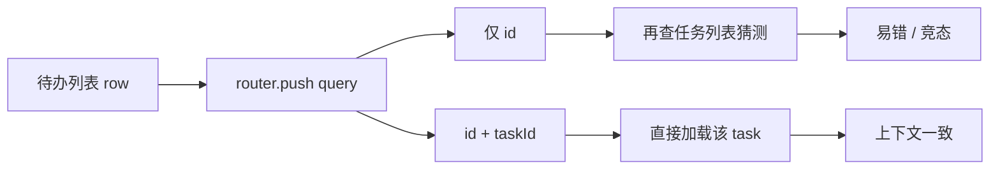

> 「后端踩坑手记」| 第 4 期

---

## 你是否也遇到过这些场景

Flowable 项目里，审批页往往有两条入口：**流程中心**（按实例查）和 **待办列表**（按任务查）。URL 长得差不多，行为却不一样。

**场景一：从待办点「办理」，办理人下拉是空的。**

你从首页待办或 BPM 待办列表点进去，地址栏只有 `?id=流程实例ID`。同一用户、同一节点，从流程监控点进去却正常。你开始怀疑又是[数据权限](/posts/backend-pitfalls-02-bpm-assignee)——但这次 Network 里 `assignee-candidates` 请求参数都不对。

**场景二：按钮状态像「在看别人的任务」。**

「同意」「驳回」有时灰掉，有时多出一套你当前节点不该出现的操作。刷新几次又好了——典型是前端在 **taskId 未就绪** 时先发了一轮请求。

**场景三：旧书签只有 `id`，新代码上线后「偶发坏」。**

老链接、消息通知里只拼了 `processInstanceId`。前端若改成「优先 taskId」，旧链接必须还有降级逻辑，否则线上会突然多一批工单。

---

## 问题的本质是什么

BPM 里 **流程实例（processInstanceId）** 和 **用户任务（taskId）** 不是一一对应在同一时刻的：

- 一个实例在并行网关下可能有多个活跃 task；
- 同一用户在不同入口，「当前要办的是哪一个 task」必须由 **taskId** 锚定。

只带 `id=processInstanceId` 时，前端常被迫：

1. 再请求「某实例下的待办列表」；
2. 用 `taskDefinitionKey`、登录人、创建时间 **猜** 当前任务；
3. 猜错或 race → 办理人接口、表单权限、按钮态全部错位。



**根因一句话**：跳转层没有把待办行里已有的 **task 主键** 交给审批页。

---

## 怎么修

**约定**：凡从「待办 / 首页待办」进专用审批页，`query` 必须同时带：

| 参数 | 含义 |
|------|------|
| `id` | 流程实例 ID（兼容旧逻辑、拉实例变量） |
| `taskId` | 当前待办任务 ID（锚定节点与办理人） |

路由解析仍可按 `processDefinitionKey` 映射到不同 `bpmProcessDetail.vue`，但 **task 维度** 不能省。

降级：仅 `id` 的旧链接可保留 fallback（查任务列表取第一条），但要打日志，推动通知模板补 `taskId`。

---

## 代码怎么写

### 跳转侧（待办 / 首页）

```typescript
// ❌ 只带实例 ID
function handleAudit(row: TaskRow) {
  router.push({
    name: resolveProcessDetailRouteName(row.processInstance.processDefinitionKey),
    query: { id: row.processInstance.id },
  });
}

// ✅ 待办 row.id 就是 taskId
function handleAudit(row: TaskRow) {
  router.push({
    name: resolveProcessDetailRouteName(row.processInstance.processDefinitionKey),
    query: {
      id: row.processInstance.id,
      taskId: String(row.id),
    },
  });
}
```

两处入口应一致：**首页待办**、**BPM → 待办事务**，避免只改一边。

### 审批页加载

```typescript
// ✅ 优先用 URL 里的 taskId
const taskId = route.query.taskId as string | undefined;
const processInstanceId = route.query.id as string;

async function loadTaskContext() {
  if (taskId) {
    return await TaskApi.getTask(taskId);
  }
  // 降级：仅旧链接
  const tasks = await TaskApi.getTaskListByProcessInstanceId(processInstanceId);
  return pickCurrentUserTask(tasks);
}
```

办理人、按钮权限、表单字段读写都应挂在 **已解析的 task** 上，而不是只挂在 instance 上。

### 后端（可选加固）

若办理人接口需要节点信息，除 `scene` 外可校验 `taskId` 与实例是否匹配，防止篡改 query 越权——这是安全加固，不是本文重点。

---

## 延伸

- 待办跳转与 [办理人为空](/posts/backend-pitfalls-02-bpm-assignee) 是不同层：taskId 解决「锚错任务」；数据权限解决「人查不到」。两个都要对，页面才正常。
- 站内信、钉钉/企业微信通知里的链接生成器，应模板化 `id` + `taskId`，别让用户收藏「半截 URL」。

**教训**：待办行上已经有 task 主键，跳转时别吝啬一个 query 参数。

---

**系列导航**：[第 3 期 快照](/posts/backend-pitfalls-03-snapshot-bpm) · [第 2 期 办理人](/posts/backend-pitfalls-02-bpm-assignee) · [第 1 期 NULL](/posts/backend-pitfalls-01-mybatis-null)
